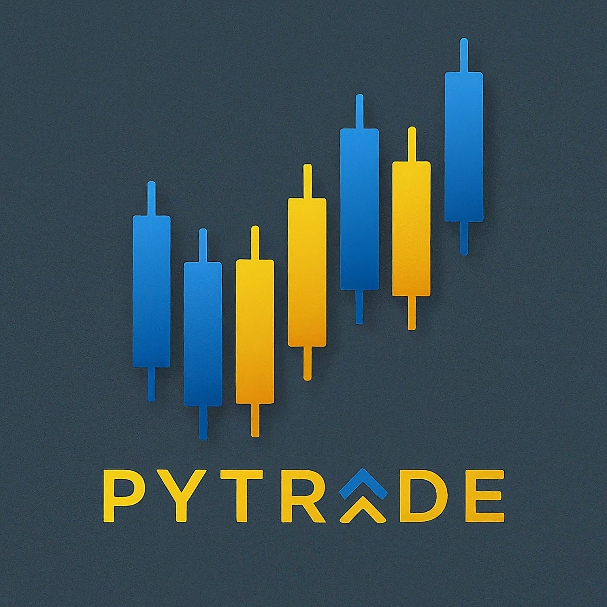

 

# Python packages and resources for algo-trading

Inspired by [PyViz](https://pyviz.org/), [PyTrade](https://pytrade.org) is a website showing a curated list of Python libraries and resources for algorithmic trading.
Think of it as an **awesome-algo-trading** list on GitHub, but with a better presentation.

> This website is owned by [PFund.ai](https://pfund.ai), a trading platform that bridges algo-trading and manual trading using AI (LLM).

### Table of Contents
- [Trading Frameworks](https://pytrade.org/trading), full-fledged frameworks that support backtesting, live trading etc.
- [Backtesting Frameworks](https://pytrade.org/backtest), do **NOT** support live trading
- [Strategies](https://pytrade.org/strategies), shared trading strategies, examples and templates
- [Models](https://pytrade.org/models), shared machine learning models for trading 
- [Time Series Analysis](https://pytrade.org/ts_analysis), for analyzing time series data
- [Analytics](https://pytrade.org/analytics), for showing performance metrics
- [Backtesting Data](https://pytrade.org/backtest_data), providing data for backtesting, free or paid
- [Live Trading Data](https://pytrade.org/live_data), providing data for live trading
- [Data Libraries](https://pytrade.org/data_libs), for getting data from the data sources
- [Machine Learning Tools](https://pytrade.org/ml_tools), for applying machine learning on data
- [MLOps Tools](https://pytrade.org/mlops_tools), for applying machine learning operations
- [Data Tools](https://pytrade.org/data_tools), for manipulating data, e.g. pandas
- [Research Tools](https://pytrade.org/researches), for doing research on data
- [Dashboard Tools](https://pytrade.org/dashboards), for creating dashboards for trading
- [Brokers & Exchanges](https://pytrade.org/trading_venues), providing APIs to support algo-trading
- [GPU Providers](https://pytrade.org/gpu_providers), providing GPUs to speed up training
- [API Integrations](https://pytrade.org/api_integrations), integrating with trading APIs without any frameworks
- [Competitions](https://pytrade.org/competitions), for algo-trading competitions
- [Resources](https://pytrade.org/resources), other resources about algo-trading


### Installation
```bash
pnpm install
```


### Development
```bash
pnpm dev
```


### Build Static Files & Run
```bash
pnpm build && pnpm start
```