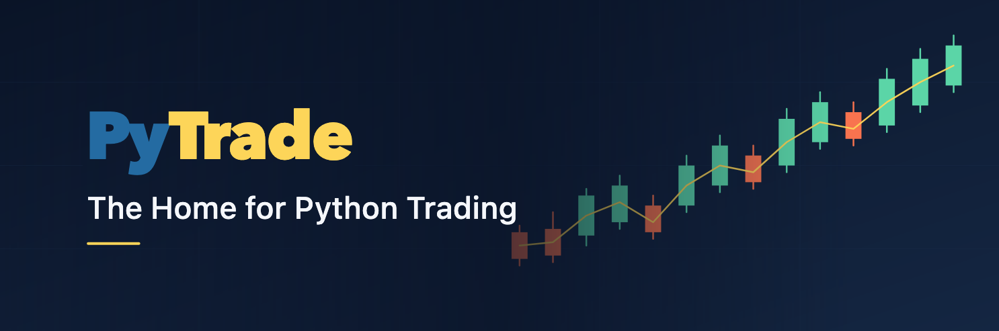

 

# PyTrade: Where Python Trading Begins

## What is PyTrade?
[PyTrade](https://pytrade.org) is an **open-source learning website** for Python trading, with **free resources** for people to get started with using Python for **AI/algo-trading**, **backtesting strategies**, building trading tools, and exploring Python trading-related libraries. 
> The site includes tutorials, guides, examples, blog posts, and curated resources.

## Curated Resources
The curated list of Python libraries and resources for trading is available at [Documentation](https://pytrade.org/doc).

## What You’ll Find

[PyTrade](https://pytrade.org) is organized around learning content and curated resources:
- **TradeLabs** — notebook-based labs for learning a topic in depth through hands-on examples.
- **Tutorials** — guided journeys that take you from zero to a finished result.
- **Guides** — step-by-step recipes for solving one specific problem.
- **Examples** — minimal working code for one specific pattern.
- **Blog** — time-stamped opinions, stories, updates, and takes on Python trading, AI trading, and the trading ecosystem.
- **Documentation** — curated lists of Python trading libraries, frameworks, tools, and resources
